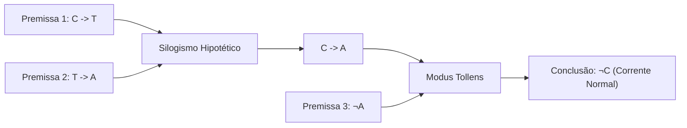

# Aula 07 – Validade de Argumentos & Regras de Inferência Lógica

---

### 1. Objetivo Pedagógico e de Engenharia
Capacitar o aluno a validar formalmente cadeias de raciocínio lógico dedutivo para diagnóstico automático de panes no drone, aplicando as regras de inferência canônicas (**Modus Ponens**, **Modus Tollens**, **Silogismo Hipotético** e **Silogismo Disjuntivo**).

---

### 2. Fundamentação Teórica Expandida (Perspectiva Discreta e Contínua)
No desenvolvimento de sistemas especialistas de apoio à decisão para estações SCADA, o motor de inferência precisa extrair conclusões seguras a partir de um conjunto de premissas factuais observadas pelos sensores.

Um **Argumento Lógico** é uma sequência de proposições $P_1, P_2, \dots, P_k$ chamadas **Premissas**, seguidas por uma proposição final $C$ chamada **Conclusão**:
$$P_1, P_2, \dots, P_k \vdash C$$
O argumento é dito **Válido** se e somente se a conjunção de todas as premissas implicar tautologicamente a conclusão:
$$(P_1 \land P_2 \land \dots \land P_k) \to C \equiv \mathbf{V}$$

---

### 3. Formulação Matemática e Exemplo Numérico
Considere as seguintes premissas de telemetria da bateria:
* **Premissa 1 ($P_1$):** Se o consumo de corrente for excessivo ($I > 60\text{ A}$), então a temperatura do BMS sobe ($T_{bms} > 60^\circ\text{C}$): $C \to T$.
* **Premissa 2 ($P_2$):** Se a temperatura do BMS subir ($T_{bms} > 60^\circ\text{C}$), o alarme de segurança deve disparar ($A=1$): $T \to A$.
* **Premissa 3 ($P_3$):** O alarme de segurança NÃO disparou ($\neg A = 1$).

**Demonstração por Regras de Inferência:**
1. De $P_1 (C \to T)$ e $P_2 (T \to A)$, por *Silogismo Hipotético*: $C \to A$.
2. De $(C \to A)$ e $P_3 (\neg A)$, por *Modus Tollens*: $\therefore \neg C$.

**Conclusão Lógica:** A corrente de descarga da bateria está rigorosamente dentro do limite seguro ($\neg C \iff I \le 60\text{ A}$).

---

### 4. Aplicação Prática em Controle e Automação (Mitigação de Alarm Flood)
* **Diagnóstico de Causa Raiz:** Emissão de diagnósticos automatizados pós-voo via registros de telemetria (*Data Logs*), isolando falhas elétricas reais de falhas espúrias de instrumentação.
* **Filtragem Inteligente de Alarmes:** Durante uma inconsistência (ex: termopar reportando aquecimento anômalo sem alarme global acionado), o motor deduz que a bateria está íntegra via *Modus Tollens*, permitindo suprimir alarmes genéricos de "Risco de Incêndio" e gerando um alerta cirúrgico de "Falha no Sensor de Temperatura do BMS" na IHM do operador.

---

### 5. Mapeamento para Provas e Exames Tecnológicos
* **Falácias Formais:**
  * Falácia da Afirmação do Consequente: $\frac{P \to Q, Q}{\therefore P}$ (Inválido).
  * Falácia da Negação do Antecedente: $\frac{P \to Q, \neg P}{\therefore \neg Q}$ (Inválido).

---

### 6. Análise de Erros Conceituais e Numéricos
* **Confundir Validade com Verdade Factual:** Um argumento pode ser formalmente válido mesmo se as premissas forem falsas no mundo real (a validade diz respeito estritamente à estrutura da dedução).
* **Supor Relação Causal Inversa:** Concluir precipitadamente que, se a bomba de calda parou, a causa foi a queima do fusível (a parada pode ter sido causada por esvaziamento do reservatório ou atuação de intertravamento de altitude).
