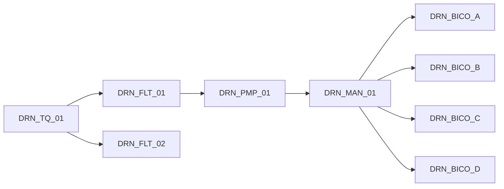

# Aula 13 — BFS, DFS e árvores de busca em tubulações

**ECAA08 · Grupo 06 · Drone agrícola de pulverização**

## Perguntas de supervisão

Quais bicos são alcançáveis a partir do reservatório? Que equipamentos ficam a jusante de um bloqueio? Há outro caminho filtrado até a bomba? As buscas recebem o modo operacional e um conjunto de vértices bloqueados, sem alterar o catálogo original.

## Busca em largura e sua árvore

A BFS utiliza fila FIFO, marca cada vértice ao descobri-lo e atribui um pai. A primeira descoberta ocorre com o menor número de arestas desde a origem. A árvore de predecessores tem um arco por vértice alcançado, exceto a raiz: $|E_T|=|V_T|-1$. Ela preserva a alcançabilidade da busca, mas não todas as redundâncias da rede.

Da raiz `DRN_TQ_01`, as camadas são: tanque (0), filtros (1), bomba (2), distribuidor (3), bicos (4). Na configuração básica há apenas o filtro principal; na proposta redundante aparecem os dois filtros na camada 1. A BFS escolhe um deles para ser pai da bomba, embora ambos possam alcançá-la.

Não se interpreta o número de arestas como número de válvulas: alguns trechos não possuem válvula própria. A BFS minimiza saltos, enquanto Dijkstra minimiza a soma dos pesos.

## Busca em profundidade

O algoritmo implementado enumera **caminhos simples** por retrocesso: ao avançar por um ramo, impede repetir vértices daquele caminho; ao voltar, permite explorar outros ramos. Na extensão redundante existem dois caminhos do tanque a `DRN_BICO_A`, um por filtro. Ao bloquear `DRN_FLT_01`, resta apenas o caminho via `DRN_FLT_02`.

Uma DFS de visita única custa $O(V+E)$, assim como a BFS com listas de adjacência. A **enumeração de todos os caminhos** pode ter quantidade fatorial de resultados em grafos densos; não recebe a mesma garantia linear. Por isso a enumeração aqui é restrita à rede pequena da simulação.

## Exemplos e ligação com a Etapa 1

Bloquear a bomba elimina todos os caminhos até os bicos, apesar da redundância dos filtros. Bloquear a origem ou o destino retorna lista vazia. A identidade origem=destino produz caminho de zero arestas, desde que o nó esteja disponível.

A condição de conectividade de aplicação é $\forall b\in\mathcal B,\;\operatorname{alcancavel}(tanque,b)$, com $\mathcal B$ não vazio. Ela complementa os quantificadores da Aula 06, mas não substitui pressão, vazão e integridade de telemetria.

O desenho representa a árvore BFS nominal na extensão; a ligação física F2→P foi excluída da árvore, não removida da planta.

**Entregável:** BFS com árvore e camadas; DFS com enumeração; cenários de filtro bloqueado, bomba indisponível, extremos bloqueados e ausência de conexão solo–drone em voo.

## Execução

Abra [13_Algoritmos_de_Busca_BFS_e_DFS_em_Tubulacoes.ipynb](13_Algoritmos_de_Busca_BFS_e_DFS_em_Tubulacoes.ipynb) e execute as células em ordem. O notebook é independente e usa somente a biblioteca padrão do Python.
