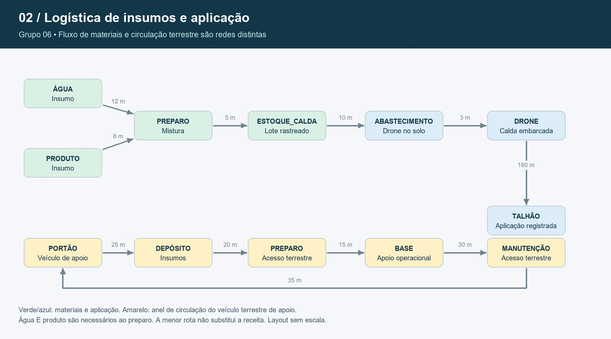
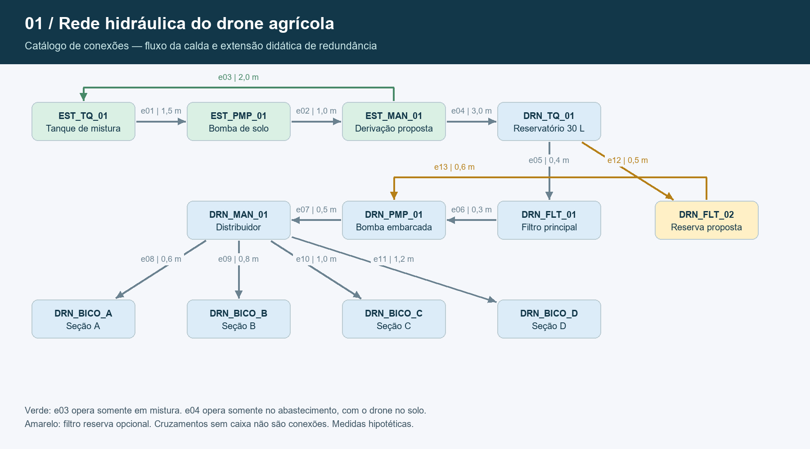
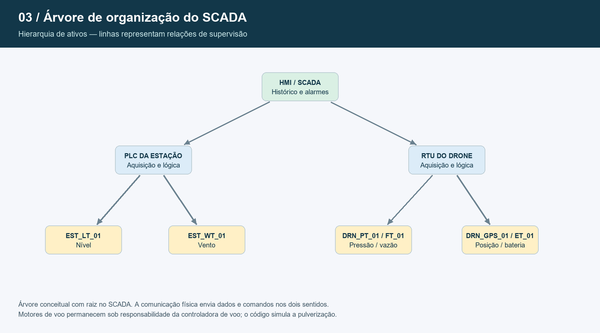

# Layout funcional — drone agrícola e estação de solo

**ECAA08 · Grupo 06 · Arthur, Caique, Luis Felipe e Marina**  
**Etapa 02 — Grafos e árvores · 28 de setembro de 2026**

O nome `aux_plantafabril.md` foi preservado para corresponder ao arquivo do professor. O conteúdo foi substituído pelo layout do projeto agrícola. Não se trata de uma fábrica de adubos.

## 1. Organização da planta

| Setor | Função | Interface com o SCADA |
|---|---|---|
| Recebimento e depósito | Disponibilizar água, produto e materiais | Identificação de lote e disponibilidade |
| Preparo e mistura | Homogeneizar calda no tanque de solo | `EST_LT_01`, `EST_PMP_01` |
| Abastecimento | Transferir calda ao drone pousado | `EST_XV_01`, nível de solo e nível embarcado |
| Base operacional | Preparar missão, carregar/trocar bateria | `DRN_ET_01`, GPS, modos e permissivos |
| Unidade embarcada | Bombear, distribuir e aplicar a calda | Nível, pressão, vazão, bomba e seções |
| Talhões | Locais de serviço e aplicação | Missão, rota, área e consumo registrados |
| Manutenção/lavagem | Inspecionar e preparar o sistema | Trechos liberados/bloqueados e eventos |

Os setores são conceituais. Nenhuma distância foi medida de uma propriedade real. Não foram transportadas as localidades, rodovias ou distâncias da fábrica de referência para a planta agrícola.

## 2. Instrumentação preservada e posição no modelo

| Tag da Etapa 1 | Grandeza/função | Local ou associação |
|---|---|---|
| `EST_LT_01` | Nível do tanque de solo, % | Equipamento `EST_TQ_01`; capacidade simulada de 500 L |
| `EST_WT_01` | Vento | Entrada ambiental; unidade adotada nos exemplos: m/s |
| `EST_TT_01` | Temperatura, °C | Contexto de aplicação, sem limiar novo nesta etapa |
| `EST_PMP_01` | Bomba de mistura/transferência | Vértice hidráulico de solo |
| `EST_XV_01` | Válvula de abastecimento | Aresta e04 |
| `DRN_LT_01` | Nível do reservatório, % | Equipamento `DRN_TQ_01`; capacidade de 30 L |
| `DRN_PT_01` | Pressão, bar | Monitoramento da descarga da bomba embarcada |
| `DRN_FT_01` | Vazão total, L/min | Monitoramento da descarga da bomba embarcada |
| `DRN_ET_01` | Estado da bateria | Campo `bateria` em %, sem confundir tensão ou corrente |
| `DRN_ZT_01` | Altitude | Origina o estado `alt_ok`; faixa permitida não redefinida |
| `DRN_GPS_01` | Posição/velocidade | Origina `gps_ok`; pontos das rotas são coordenadas locais |
| `DRN_PMP_01` | Bomba PWM | Vértice hidráulico embarcado; estado booleano nos exemplos |
| `DRN_XV_01` | Família de válvulas seccionadoras | Desdobrada em `DRN_XV_01A` até `DRN_XV_01D` |

Os quatro bicos representam quatro seções agregadas; não fixam a quantidade comercial de bicos físicos do drone. A telemetria global não identifica qual seção falhou. Os sensores por seção da Aula 06 podem ser incorporados em uma extensão futura.

## 3. Hipóteses adicionais de engenharia

- Tanques, distribuidores e filtros recebem IDs próprios para modelagem; esses IDs não são novas medições.
- A bomba de solo compartilha funções de recirculação e transferência por seleção de modo. O arranjo exato depende de projeto hidráulico posterior.
- `EST_XV_REC` é uma válvula de retorno proposta para representar o modo mistura.
- `DRN_XV_F1_IN` e `DRN_XV_F1_OUT` são válvulas de isolamento propostas para o ramal do filtro principal. Sem essas válvulas e confirmação física, não se pode alegar isolamento automático real.
- `DRN_FLT_02`, e12/e13 e `DRN_XV_F2_IN/OUT` são a extensão opcional para estudar rota alternativa filtrada. Não aparecem como componentes já existentes na Etapa 1.
- Comprimentos de mangueira e diâmetros são parâmetros didáticos, sem dimensionamento por perda de carga ou curva da bomba.
- Disponibilidade de um arco significa possibilidade de planejar seu uso, não válvula aberta nem vazão efetiva.

## 4. Sequência operacional

O desenho é uma sequência de estados, diferente do grafo de tubulações. Na simulação, mistura, abastecimento e voo selecionam subconjuntos distintos das arestas. Não há caminho de alimentação contínua da estação ao drone em voo.

## 5. Arquitetura e árvores

A árvore organiza os ativos: SCADA/HMI na raiz; PLC de solo e RTU embarcada como ramos; instrumentos como folhas. É uma árvore de relações de supervisão, não uma descrição de comunicação unidirecional. Os dados sobem e os comandos permitidos descem na arquitetura funcional.

Os notebooks também geram uma árvore BFS de alcançabilidade (Aula 13) e uma árvore geradora mínima de distâncias entre pontos de missão (Aula 17). São três usos diferentes de árvores.

A controladora de voo não é substituída por estes notebooks. O SCADA simula supervisão, proposta de trajetos e bloqueio de pulverização. Não há código de acionamento de motores, corte de propulsão ou retorno autônomo real.

## 6. Logística e rastreabilidade

O fluxo de calda acompanha lote, abastecimento, missão, talhão e volume aplicado. O resultado do processo é aplicação registrada, sem almoxarifado de produto acabado. Uma rota mais curta não substitui os dois insumos necessários ao preparo nem confirma que o lote esteja pronto.

O anel de apoio terrestre mantém depósitos, área de preparo, base e manutenção conectados. Baterias recarregadas, embalagens e resíduos de lavagem exigem redes segregadas, apenas identificadas como extensão. Não se liga o fluxo de resíduos ao estoque de calda.

## 7. Escopo implementado

Implementados: cadastro topológico, matrizes, balanço, BFS/DFS, árvores de busca, Dijkstra, falhas e estados retidos, Euler/Hierholzer, TSP/2-Opt, comparação exata, AGM/Prim, DAG logístico e registros simulados.

Não implementados nesta entrega: hardware, projeto mecânico/hidráulico detalhado, cobertura de área por faixas, dinâmica de voo, estimador calibrado de bateria, interface HMI interativa e servidor de histórico. As saídas dos notebooks representam dados que podem alimentar essas próximas etapas.
